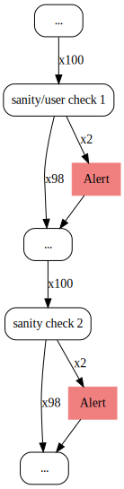
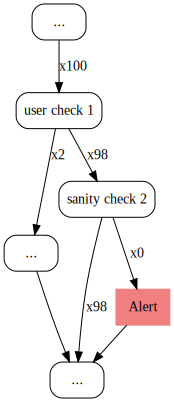
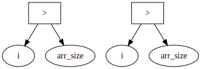
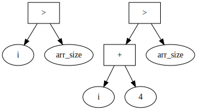
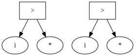
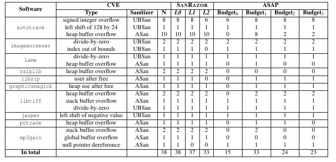

# SANRAZOR: Reducing Redundant Sanitizer Checks in C/C++ Programs[OSDI'21]

github: <https://github.com/SanRazor-repo/SanRazor>

<!-- 
## 調査目的
-->

## 概要

- 問題
  - Sanitizerによる実行時間オーバーヘッドが大きい
    - AddressSanitizer (ASan): +73%
    - UndefinedBehaviorSanitizer (UBSan): +160%
- 提案手法
  - "冗長"なsanityチェックを検出
    - Profile情報
    - データ依存関係
  - "冗長"なsanityチェックを削除
- 実験結果
  - 実行時間オーバーヘッドを大きく削減
    - ASan: +73% &rarr; +28.0-62.0%
    - UBSan: +160% &rarr; +36.6-124.4%
  - バグの検知能力は大きく低下しない
    - 33 out of 38 CVEs

## "冗長"なsanityチェック

### 「理想的」なsanityチェックの冗長判定

以下の条件が成立するとき，sanityチェック`c`は"冗長"である:
- 制御: `c`は他のsanityチェック`c'`にdominateされる
- 意味: `c`と`c'`は同じチェックである(semantically equivalent)
- 種類: `c`と`c'`は同じSanitizerによるチェックである
  - ex) どちらもASanによるチェック

Ex) "冗長"なsanityチェック
```c
// c': check arr[i]
if (i > arr_size) report();
k = arr[i];
// c: check arr[i]
if (i > arr_size) report();
arr[i] = k + 1;
```

### 「近似的」なsanityチェックの冗長判定

以下のように冗長判定を近似する:
- 制御: Profile情報に基づく，チェックの実行回数
  - 静的制御フロー解析では，ポインタ周りで精度が低下する
  - 狙い: もっと強気に冗長性を削除したい
- 意味: データ依存パターンで同値判定
  - 同じチェックかどうかを正しく判定するのは難しい
  - &rarr; パターンが同じかどうかで判定
- 種類: Sanitizer固有の関数名で判定
  - ex) ASan: `__asan_report`, UBSan: `__ubsan_handle_XXX`

## SANRAZOR: "冗長"なsanityチェックの削除

ステップ:
1. 制御: Workloadの実行 + Profilingにより，Dominatorを求める
2. 意味: 静的解析により，チェックするデータが同じかを判定する
3. 冗長なsanityチェックの削除

提案手法の特徴
- Sanitizerの種類に依らない
  - ASan, UBSanに限らず利用できる
- Unsoundな冗長性削除
  - 冗長判定が強気 (安全側に倒していない)

### 1. 制御: Dominatorを求める

ステップ:
1. 全ての`br`命令に対して，実行回数をカウントするように計装
2. Workload(test suite)を実行して，Profile情報を取得
3. 各`br`命令の実行回数，分岐先が求まる

Dominatorと判定する条件:
- 全実行回数が一致
- ユーザーチェックと一致

全実行回数が一致:  


ユーザーチェックと一致:  


### 2. 意味: チェックするデータが同じかを判定する

ステップ:
1. `br`命令のオペランドをデータ依存グラフで表現
2. 3つの戦略で，データ依存グラフに対して同値判定

Ex)
```c
// c': check arr[i]
if (i > arr_size) report();
k = arr[i];
// c: check arr[i]
if (i > arr_size) report();
arr[i] = k + 1;
```



同値判定における3つの戦略:
- L0: 全ノードの一致
- L1: 定数ノード(比較命令のオペランドを除く)を除いたノードの一致
- L2: 定数ノードを除いたノードの一致

Ex)
```c
// c': check arr[i]
if (i > arr_size) report();
k = arr[i];
// c: check arr[i]
if (i + 1 > arr_size) report();
arr[i + 1] = k + 1;
```

L0の場合: 不一致  


L1の場合: 一致  


L2の場合: 一致  


### 3. 冗長なsanityチェックの削除

上記で求めた２つの条件を両方とも満たすsanityチェックを"冗長"と判定し削除:
- Dominatorの判定
- データ依存グラフの一致判定

Ex) sanityチェック`c`は冗長 (分岐実行回数が一致 & データ依存グラフが一致)
```c
// c': check arr[i]
if (i > arr_size) report();
k = arr[i];
// c: check arr[i]
if (i > arr_size) report();
arr[i] = k + 1;
```

## 実験結果

- RQ1. 実行時間オーバーヘッドはどれだけ削減できたか？
- RQ2. バグ検知能力はどの程度落ちているか？
- 実験環境
  - CPU: Intel i7-8700
  - Memory: 16GB

### RQ1. 実行時間オーバーヘッドの削減

検体: SPEC CPU2006ベンチマーク

| Sanitizer | Full | L0 | L1 | L2 |
| --- | --- | --- | --- | --- |
| ASan | 73.8% | 62.0% | 35.8% | 28.0% |
| UBSan | 154.3% | 124.4% | 94.7% | 36.6% |

### RQ2. バグ検知能力

検体: 10のリアル検体(38のCVE)  
既存研究: ASAP[SP'15] (実行回数の多いhotなsanityチェックを削除)  
結果: L2において，33のバグを検出



## 自分の研究との関連

- データフロー保護にも併用できる
  - "冗長"なデータの定義元確認を減らせる
  - ASAP[SP'15]以上に保護能力が保証されている
  - (Unsoundな最適化である点に注意)
- 実行速度が求められる場合は使いたい
  - LLVM IRのみを保護対象とする場合
    - 関連研究の実行速度が速い
  - カーネルを保護対象とする場合
- 選択的データ保護とも組み合わせられそう
