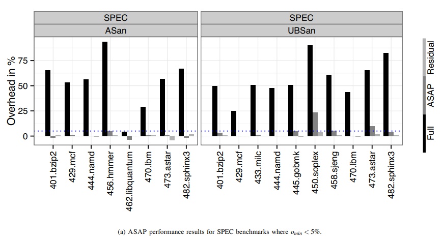

# ASAP[SP'15]

## 概要

- 問題
  - 実行時チェックによる保護機構は遅い
    - AddressSanitizer: +73%
    - UndefinedBehaviorSanitizer: +71%
- 困難: 保護能力とオーバーヘッド削減の両立
- 提案手法
  - ユーザーが許容できる実行時間オーバーヘッドを指定
  - 許される範囲内で実行時チェックを行う
- 実験結果
  - cost-level 0.01(全体のチェック時間の1%)で，OpenSSL, CPython, その他ベンチマークの知られている脆弱性を全て検知できた．

## 手法: ASAP

- ASAP: as secure as possible
  - 意味: 与えられた予算"overhead budget"の中で，できる限りセキュリティを高める
- 仮定: バグは実行回数の多い(hotな)コードよりも，実行回数の少ない(coldな)コードに潜んでいる．
- 手法
  1. Sanitizerでプログラムを計装
  2. Profiling workload(test suite)を用いて，各実行時チェックの回数を計測
  3. 予算に収まるように，実行回数の多い(hotな)チェックを削除
  4. プログラムを出力

## 実験結果

i) パフォーマンス
SPEC2006ベンチマークを用いて，ASAPが実行オーバーヘッドを抑えられるか検証．  

ii) セキュリティ
OpenSSL, Python interpreter, RIPEベンチマーク(buffer overflow exploits)を用いて，ASAPの保護能力を検証．
- OpenSSL Heartbleed
  - バグを検知
  - Overhead: 5%
- Python interpreter
  - 全てのバグを検知
  - Overhead: 55% (理由はASanによるメタデータ管理)

## 議論・考えたこと

- ASAPが上手くいく要因
  - Profiling workloadとしてtest suiteを用いた
    - Test suiteが通るパスにバグは少ない（はず）
  - Test suiteが用意されていて，メンテされているコードに対して非常に有効そう
- オーバーヘッド削減について
  - Pros: 与えられた予算に抑えられる，全自動
  - Cons: 安全である保証が得られない

