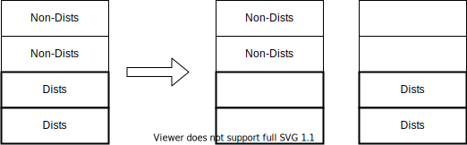
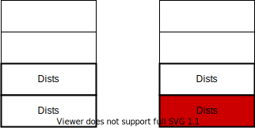
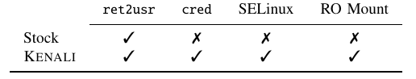
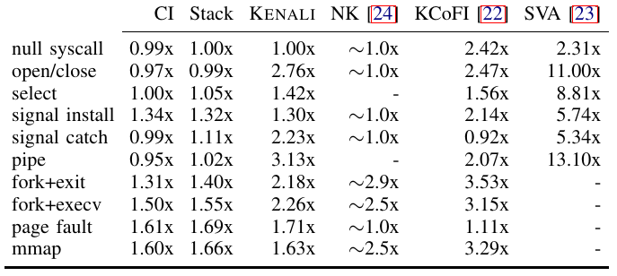
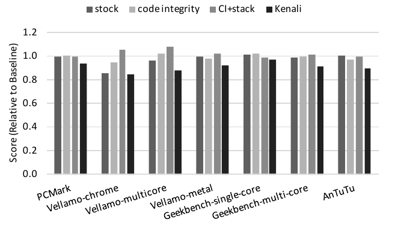

# KENALI[NDSS'16]

## 概要

- 問題
  - OSカーネルはシステムの基盤であるが，脆弱性は珍しくない
  - 既存研究は
    - Control-Flowのみを保護するが，保護が十分でない
    - driver/moduleのみを保護する
    - 全体を保護するが，オーバーヘッドが大きい
- 困難: カーネル全体を保護しながら，オーバーヘッドを抑えるのは難しい
- 提案手法
  - 権限昇格に関するデータを保護
  - 保護すべきデータを絞ることでオーバーヘッドを抑える
- 実験結果
  - 保護能力: リアル検体に対する全ての権限昇格攻撃を検知できた
  - オーバーヘッド
    - Runtime: ユーザー空間ベンチマークにおいて，+5-17%
    - Memory: +2%

## 権限昇格

カーネル内のReference monitor(アクセス制御)は以下のように実装されている:
```c
// monitor-1
if (have_priv()) // check privilege
  return ok;
else
  return err;
```

```c
// monitor-2
if (have_priv()) // check privilege
  data_access
```

権限昇格は，データを攻撃することでL.2の権限確認の結果を変更してしまう．

## 手法

1. InferDists: 保護すべきデータを自動推論
2. ProtectDists: データを保護

### InferDists

保護すべきデータ Dists:
- 権限確認に関わるデータ
- Distsとdata-, control-依存である変数

推論手法
1. `return err`とデータアクセス文を特定
2. それらを実行するかどうか決定する分岐命令(dominator)を特定
3. 分岐命令の条件変数をDistsに追加
4. Distsとdata-, control-依存である変数を追加

### ProtectDists

保護すべきデータDistsのみを保護するため，二段階の保護を行う:
1. Data-Flow Isolation: Non-DistsとDistsを分離
  - 目的: Non-Dists &rarr; Distsというデータ改変を防ぐ  


2. Data-Flow Integrity: Dists内のデータをDFIで保護
  - 目的: Dists &rarr; Distsというデータ改変を防ぐ
  - DFI: オーバーヘッドを抑えるためWITを利用
    - Normal DFI: 読み込み時に定義元の確認
    - WIT(write integrity testing): 書き込み時に定義元の確認  


## 実装

AArch64を対象に，ハードウェア支援を活用しながら効率的に実装．  
（かなり頑張っていて，まだ全て理解しきれていない）

## 実験結果

### Security Evaluation

論文中で提示されている全ての権限昇格攻撃を防げている．  


### Performance Evaluation

i) System calls benchmarks
systemcallにつき，x1-3倍くらいのオーバーヘッド  


ii) Android benchmarks(ユーザー空間)
Android benchmarksに対して +7-15%くらいのオーバーヘッド  


## 議論・考えたこと

- データ保護について
  - Pros: 上手に保護対象を絞る
  - Cons: Use-After-Freeに無力 (WITは書き込み時のみ確認するため)
- 実装について
  - Pros: ハードウェア支援をうまく活用していて速い
  - Cons: ハードウェア依存（筆者らは他のハードウェアでも同じような機能が使えると主張している）

